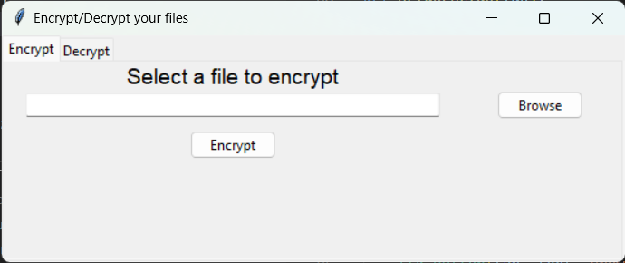
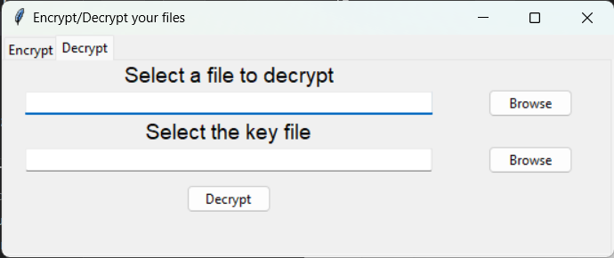

# File Encryption and Decryption Program

## Description
This program provides a graphical user interface (GUI) to encrypt and decrypt files using the `cryptography` library's `Fernet` symmetric encryption. It generates a unique key for each file encrypted and uses this key for decryption. The program is implemented in Python and uses the Tkinter library for the GUI.

## Setup and Usage

### Prerequisites
- Python 3.x installed on your machine.
- `cryptography` library installed (`pip install cryptography`).

### Installation and Running the program
1. Clone the repository or download the project files.
2. Navigate to the project directory.
2. Run the main script:
   ```bash
   python main.py
   ```

This will launch the GUI for the program.

### GUI Overview
The GUI has two tabs: **Encrypt** and **Decrypt**.

#### Encrypt Tab

1. **Select a file to encrypt**: Use the "Browse" button to choose the file you want to encrypt.
2. **Encrypt**: Click the "Encrypt" button to encrypt the selected file. The program will generate a key and save it in the same directory as the original file. The encrypted file will have the extension `.enc`.

#### Decrypt Tab

1. **Select a file to decrypt**: Use the "Browse" button to choose the `.enc` file you want to decrypt.
2. **Select the key file**: Use the "Browse" button to choose the `.key` file associated with the encrypted file.
3. **Decrypt**: Click the "Decrypt" button to decrypt the selected file. The decrypted file will be saved with the suffix `_dec` added to the original filename.

## Encryption Process
The encryption process uses the `cryptography` library's `Fernet` encryption scheme:

1. **Key Generation**: A unique key is generated using `Fernet.generate_key()` and saved to a file with the extension `.key`.
2. **File Encryption**: The selected file is read, encrypted using the generated key, and saved with the extension `.enc`.

### Key Functions for Encryption
- `genkey()`: Generates a new encryption key.
- `encryptfile(filepath, key)`: Encrypts the specified file using the provided key.
- `writetofile(txt, filename, ext)`: Writes the encrypted data to a new file with the specified extension.

## Decryption Process
The decryption process also uses the `cryptography` library's `Fernet` encryption scheme:

1. **Key Reading**: The key file associated with the encrypted file is read.
2. **File Decryption**: The selected encrypted file is read, decrypted using the provided key, and saved with the suffix `_dec` added to the original filename.
